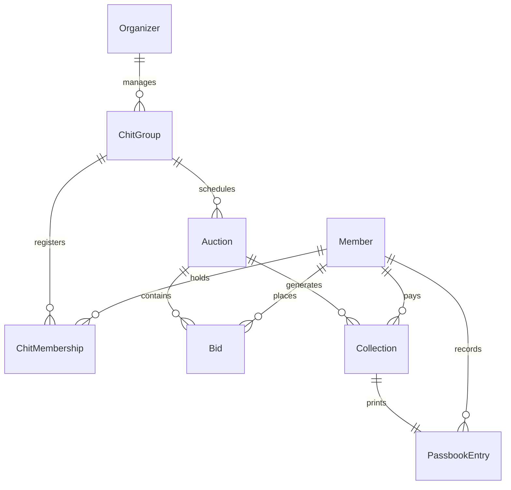

# Entity Relationship Design (ER Diagram)

This document maps the business entities of the Chit Fund Management System and defines the structural and relational dependencies between them.

---

## 1. Main Entities

*   **Organizer:** Manages chit groups and collections.
*   **ChitGroup:** Represents a specific chit scheme running over a duration.
*   **Member:** Customer participating in one or multiple chit groups.
*   **ChitMembership:** Bridge table matching members to specific chit groups. Includes slot position and winning status.
*   **Auction:** Logs the monthly bidding process, winning participant, and dividends.
*   **Bid:** Individual bid amounts placed by members during an active auction.
*   **Collection:** Tracks monthly billing, payable amounts, actual paid amounts, and late payment interest.
*   **PassbookEntry:** Individual receipt/passbook transactions logged per payment/bonus received.

---

## 2. Relationship Diagram

### Conceptual Layout
```text
Organizer (1) -------> (N) ChitGroup
ChitGroup (1) -------> (N) ChitMembership <------- (N) Member
ChitGroup (1) -------> (N) Auction
Auction   (1) -------> (N) Bid
Auction   (1) -------> (N) Collection
Collection(1) -------> (1) PassbookEntry
```

### Database Entity-Relationship Diagram (Mermaid)


---

## 3. Detailed ER Schema

### Organizer
```text
id (PK, UUID)
name (VARCHAR)
mobile (VARCHAR)
```

### ChitGroup
```text
id (PK, UUID)
organizer_id (FK -> Organizer.id)
name (VARCHAR)
duration_months (INTEGER)
member_count (INTEGER)
monthly_amount (DECIMAL)
maintenance_charge (DECIMAL)
start_date (DATE)
status (VARCHAR)
```

### Member
```text
id (PK, UUID)
name (VARCHAR)
mobile (VARCHAR)
address (TEXT)
status (VARCHAR)
```

### ChitMembership
```text
id (PK, UUID)
chit_group_id (FK -> ChitGroup.id)
member_id (FK -> Member.id)
join_date (TIMESTAMP)
position_no (INTEGER)
won_status (BOOLEAN)
```

### Auction
```text
id (PK, UUID)
chit_group_id (FK -> ChitGroup.id)
month_no (INTEGER)
winner_member_id (FK -> Member.id)
bid_amount (DECIMAL)
bonus_per_member (DECIMAL)
winner_receivable (DECIMAL)
auction_date (TIMESTAMP)
```

### Bid
```text
id (PK, UUID)
auction_id (FK -> Auction.id)
member_id (FK -> Member.id)
bid_amount (DECIMAL)
```

### Collection
```text
id (PK, UUID)
auction_id (FK -> Auction.id)
member_id (FK -> Member.id)
payable_amount (DECIMAL)
paid_amount (DECIMAL)
penalty_amount (DECIMAL)
payment_date (TIMESTAMP)
status (VARCHAR)
```

### PassbookEntry
```text
id (PK, UUID)
collection_id (FK -> Collection.id)
member_id (FK -> Member.id)
month_no (INTEGER)
installment (DECIMAL)
bonus (DECIMAL)
payable (DECIMAL)
entry_date (TIMESTAMP)
```

---

## 4. Relationship Verification

*   **One Organizer → Many Chits:** An organizer manages multiple active chit groups (e.g., 1 Lakh Chit, 2 Lakh Chit).
*   **One Chit → Many Members:** A group comprises multiple members, each assigned to a single unique membership slot (e.g., Position 1: Ramesh, Position 2: Suresh).
*   **One Member → Many Collections:** A member has collections generated for them month-on-month (e.g., Month 1 Paid, Month 2 Paid).
*   **One Chit → Many Auctions:** A group holds one auction session per month for its duration (e.g., Month 1 Auction, Month 2 Auction).

---

## 5. Business Constraints

1.  **Constraint 1:** One member can win only once per chit.
2.  **Constraint 2:** Only active members can bid.
3.  **Constraint 3:** Once a member wins an auction in a group (`won_status = true`), they cannot bid in future auctions for that group.
4.  **Constraint 4:** Auction must exist for a month before that month's collections/dues can be finalized.
5.  **Constraint 5:** All registered members of the group receive an equal share of the bonus dividend.
6.  **Member Position Number (`position_no`):** Members are assigned a fixed seat number (e.g., Position 1 to 20) in a group during onboarding. This is used for sorting, reporting, and identification.
